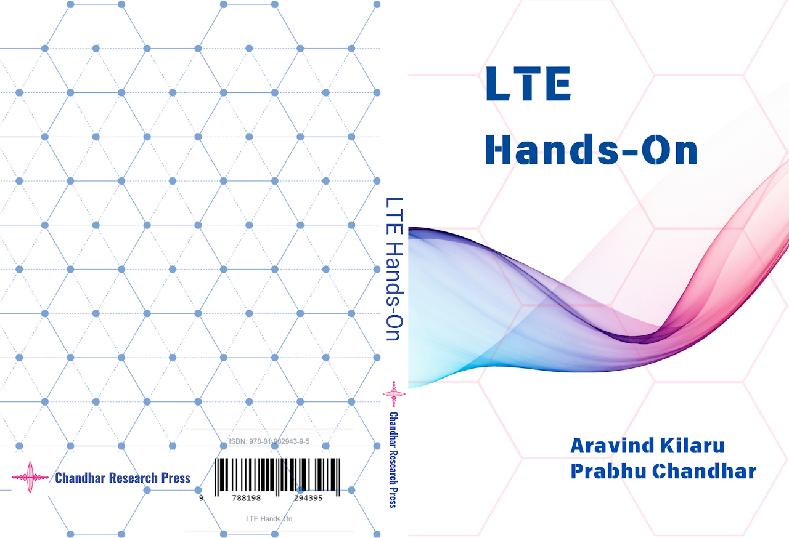
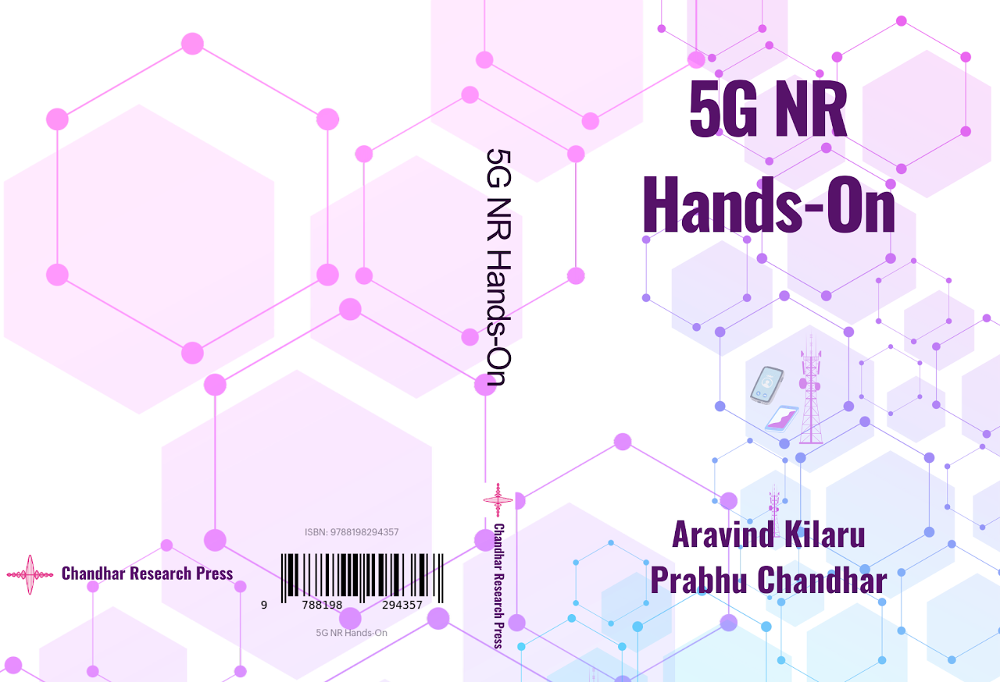

# Books

Books authored and published by **Chandhar Research Labs Pvt. Ltd.**
focus on **hands‑on learning, real testbeds, and practical wireless systems**.

---

## 📘 LTE Hands‑On

A comprehensive laboratory manual for understanding **4G LTE systems**
through real experiments.

👉 [View Book Details](lte-hands-on.md)

---

## 📕 5G NR Hands‑On

An end‑to‑end practical guide to **5G Standalone and Non‑Standalone networks**.

👉 [View Book Details](5g-nr-hands-on.md)

