# 5‑Nines Radio – 5G Testbed

!!! info "Why the name Five‑Nines Radio?"
    **Five‑Nines Radio** refers to a 5G radio communication system designed
    to achieve a high level of reliability and availability, often measured
    as **“five nines” (99.999% uptime)**. The main objective is to engineer the radio system to maintain
    connectivity and communication capabilities with **minimal downtime**,
    ensuring reliable operation even in **challenging environments or
    adverse conditions**.

**5‑Nines Radio** is a high‑reliability 5G testbed platform designed to evaluate
ultra‑reliable low‑latency communication (URLLC) scenarios.

<h2 class="features">Five-Nines Radio Architecture</h2> There are two operating modes of Five-Nines Radio:

- Five-Nines Radio – 5G Non-Stand Alone (NSA) mode
- Five-Nines Radio – 5G Stand Alone (SA) mode

In NSA mode, to establish a connection with a 5G Smartphone, one requires a 4G base station (i.e. eNB), a 5G base station (i.e. gNB), and a 4G core network (CN), i.e. evolved packet core (EPC). All control-plane traffic is handled by the eNB whereas the user-plane traffic is handled by the gNB. In SA mode, both the control-plane and user-plane traffic are handled by the gNB and 5G core network.

<h2 class="features">Table 1. Components of Five-Nines Radio</h2>

| Components | Specifications |
|-----------|----------------|
| Components | CN Emulator eNB Emulator gNB Emulator eNB/gNB Transceiver – Sub‑6 GHz 5G IoT Bridge 5G Smartphone Programmed SIM cards |
| CN, gNB, eNB Emulator Hardware | I5/I7 Processor, 1 TB HDD, 16 GB RAM |
| Protocol Stack | NSA: EPC, gNB, eNB: 3GPP Rel. 15 SA: 5G Core, gNB: 3GPP Rel. 17 |
| eNB Bandwidth | 5, 10, and 20 MHz |
| gNB Bandwidth (Sub‑6 GHz) | 5, 10, 20, and 40 MHz |
| Duplex Mode | eNB – FDD, gNB – TDD |
| Operating Band | B7 & n78 (2600 MHz & 3600 MHz) |
| MIMO Support | 1x1 (eNB), 2x2 (gNB) |

## 5‑Nines Radio Configurations

- **NSA Full:** *CPUs:* 3(5G Core, gNB, eNB), *SDR Units:* 2, *Smartphones:* 2, *IoT Bridge*, *Architecture Support:* 5G NSA and SA
- **SA Standard:** *CPUs:* 2 (5G Core, gNB), *SDR Units:* 1, *Smartphones:* 1, *IoT Bridge*, *Architecture Support:* 5G SA
- **SA Compact:** *CPUs:* 1 (5G Core + gNB combined), *SDR Units:* 1, *Smartphones:* 1, *IoT Bridge*, *Architecture Support:* 5G SA
- **Lite:** *CPUs:* 1 (5G Core + gNB emulated + UE emulated), *Architecture Support:* Virtualized 5G emulation

## Feature Comparison

| Feature | NSA Full | SA Standard | SA Compact | Lite |
|-------|---------|-------------|------------|------|
| **Processing Units** | 3 CPUs | 2 CPUs | 1 CPU | 1 CPU (Emulated) |
| **SDR Units** | 2 | 1 | 1 | - |
| **Smartphones** | 2 | 1 | 1 | - |
| **IoT Bridge** | Yes | Yes | Yes | - |
| **gNB (5G NodeB)** | NSA: Rel 15 SA: Rel 17 | SA: Rel 17 | SA: Rel 17 | SA: Rel 17 (Emulated) |
| **eNB (LTE NodeB)** | Yes (Rel 15) | – | – | – |
| **Operating Frequency Band** | NSA: B7 & n78 (2600 MHz & 3600 MHz) SA: n78 | n78 (3600 MHz) | n78 (3600 MHz) | – |
| **eNB Bandwidth** | 5, 10, 20 MHz | – | – | – |
| **gNB Bandwidth (Sub‑6 GHz)** | 20, 40 MHz | 20, 40 MHz | 20, 40 MHz | Emulated |
| **Duplexing Mode** | eNB: FDD gNB: TDD | gNB: TDD | gNB: TDD | Emulated |
| **MIMO Support** | 2×2 | 2×2 | 2×2 | - |
| **Typical Range** | 70 ft (LoS) 30 ft (NLoS) | 70 ft (LoS) 30 ft (NLoS) | 70 ft (LoS) 30 ft (NLoS) | Lab Only |
| **Programmed SIM Cards** | 10 | 10 | 10 | - |
| **Manual Operation** | Yes | Yes | Yes | Yes |
| **3GPP Release Support** | Rel. 15 (NSA) Rel. 17 (SA) | Rel. 17 | Rel. 17 | Rel. 17 |

<h2 class="features">Features</h2>

The main features of Five-Nines Radio are as follows.

- Affordable for academic institutions
- User-friendly handling for faculty members and students
- Highly scalable
- Assured long-term technical and research support

Moreover, the Five-Nines Radio is designed to support:

- Industry-relevant experiments
- 5G protocol testing
- 5G research and development
- Student projects in academia
- Build product prototypes

## Sample Academic Experiments
- **Module 1: 5G Core & UE Procedures:**
    - UE registration and PDU session establishment (SA & NSA)
    - 5G authentication and security
    - SBA traffic flow analysis using PCAP and REST APIs
    - NGAP and PFCP message tracing
- **Module 2: 5G RAN Protocol Stack**
    - DU–CU split architecture
    - Layer‑wise tracing (SDAP/PDCP/RLC/MAC/PHY)
- **Module 3: 5G Physical Layer**
    - OFDM, PDSCH, DMRS waveform generation
    - Uplink and downlink channel characterization
- **Module 4: Performance Optimization**
    - Network slicing (eMBB, URLLC, mMTC)
    - Link adaptation and CQI feedback
    - TDD slot configuration impact
    - SISO vs 2×2 MIMO performance
- **Module 5: 5G + IoT + Edge**
    - Raspberry Pi with 5G modem
    - MQTT‑based IoT communication
    - Machine‑type communication using dual 5G bridges
<h2 class="features">Support</h2>

- **Training**: One week of training every six months for three years at either customer premises or Chandhar Research Labs, Chennai. Support to faculty members in drafting lab, skilling, and tutorial manual for the proposed experiments will be provided.

- **Internships**: Internship opportunities will be provided for eligible UG and PG students in Wireless Communications, 5G, IoT, and RF Machine Learning. The selected students will be assigned to work on the following topics ranging from 2 to 6 months.

- **FDPs**: We will provide support to organize faculty development programs in topics such as AI/ML in wireless, 5G, and 6G.

- **Research Collaboration**: Faculty members, UG and PG students, and research scholars can collaborate with Chandhar Research Labs on the development of 5G use cases including standard development and research publication in conferences and journals.

---

## Product
Click on images to view larger.

{data-caption="Five-Nines Radio Infrastructure at KL University, Hyderabad"}
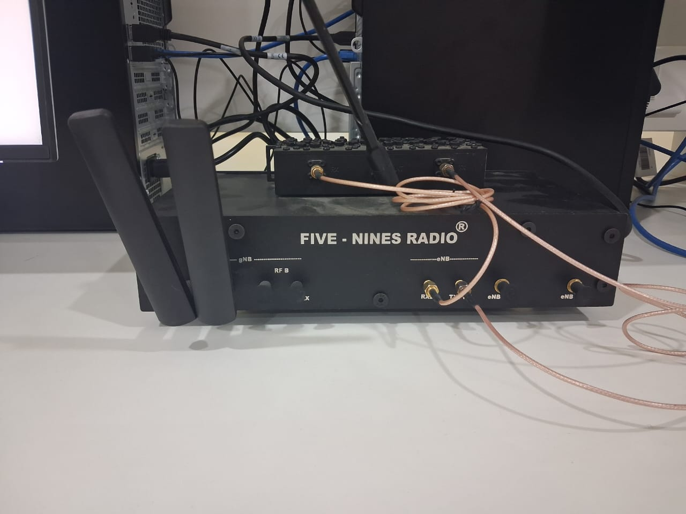
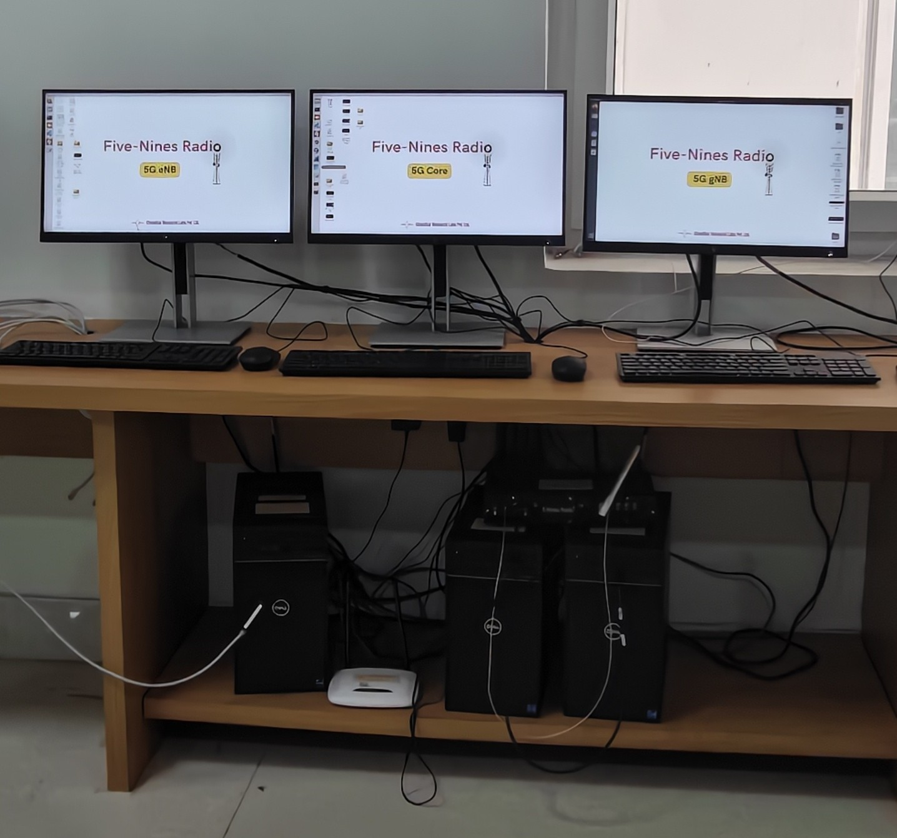{data-caption="Five-Nines Radio Infrastructure at KL University, Guntur"}
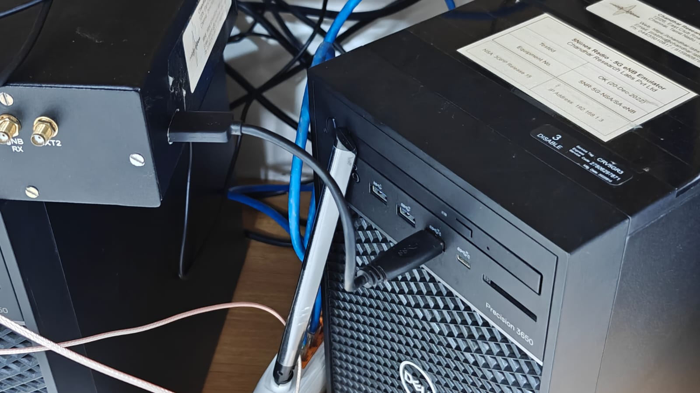
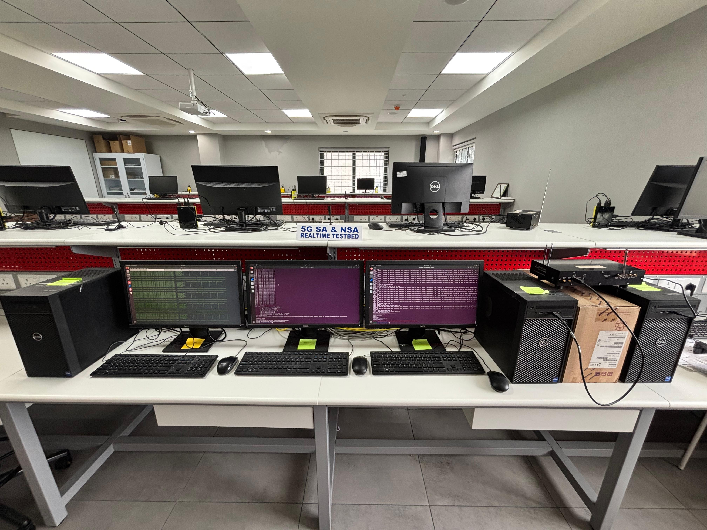{data-caption="Five-Nines Radio Infrastructure at Mahindra University, Hyderabad"}
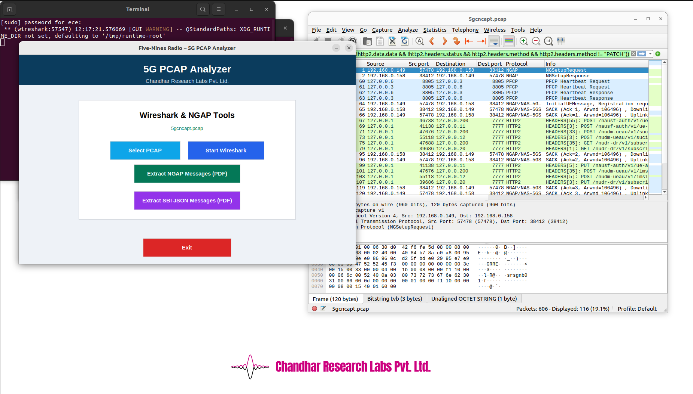
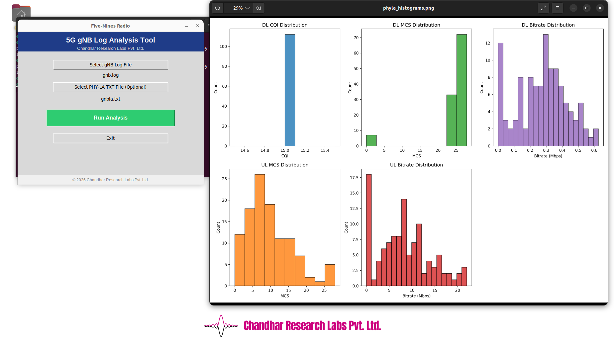
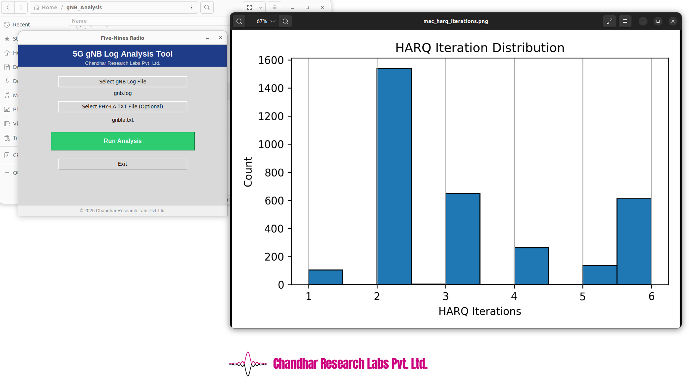
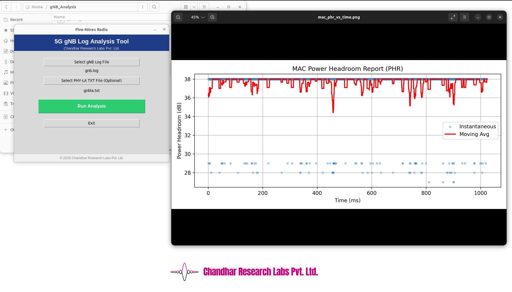
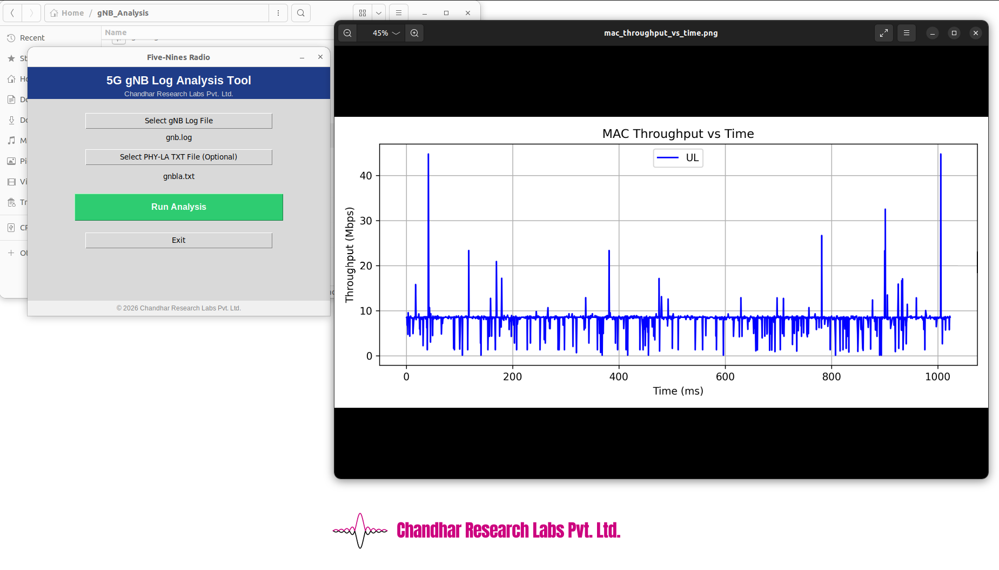
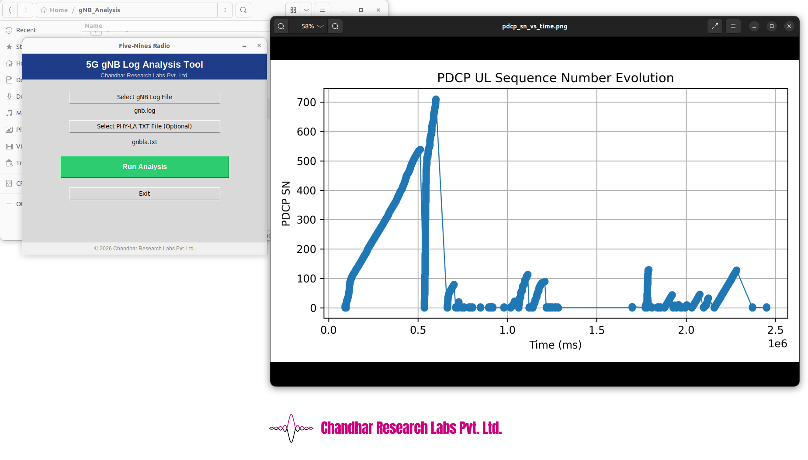
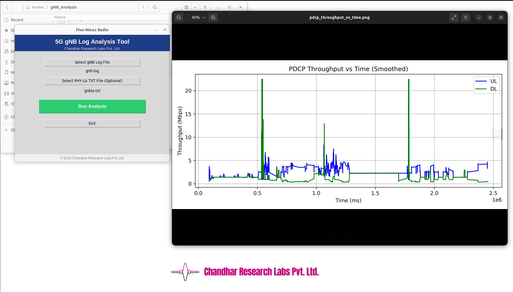
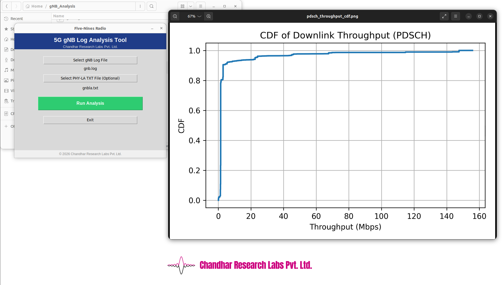
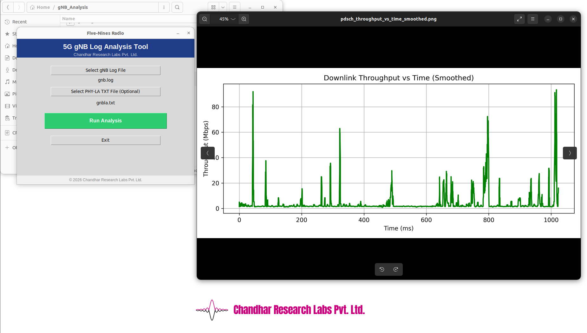
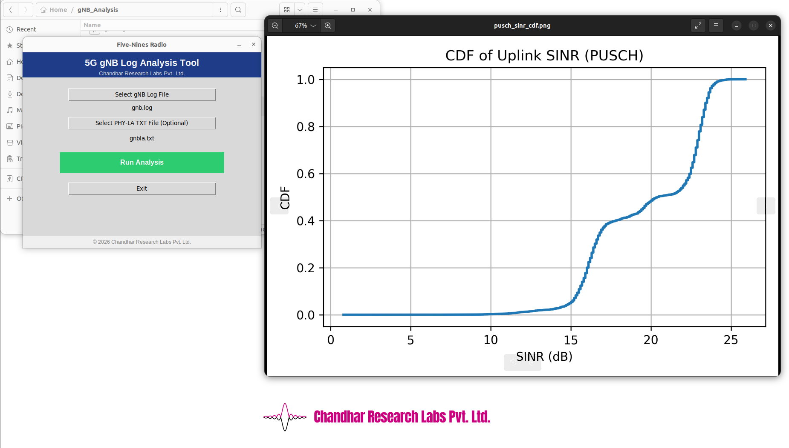

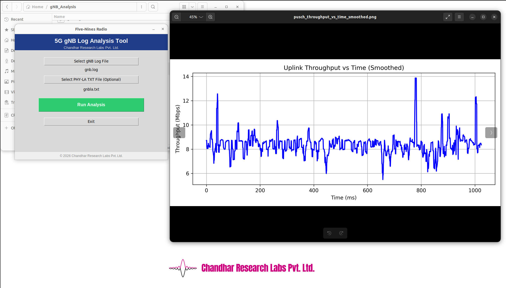

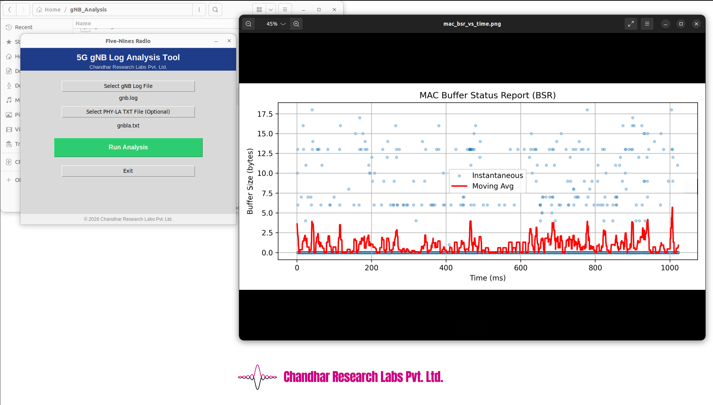

---

## Videos

  

    <iframe src="https://www.youtube.com/embed/uYvTnKspwmk" allowfullscreen></iframe>
  

  

    <iframe src="https://www.youtube.com/embed/yh54K9aB9J4" allowfullscreen></iframe>
  

  

    <iframe src="https://www.youtube.com/embed/VDdi6t_ia2E" allowfullscreen></iframe>
  

  

    <iframe src="https://www.youtube.com/embed/YKWGEuXFE0Q" allowfullscreen></iframe>
  

  

    <iframe src="https://www.youtube.com/embed/I5_PiAPpX9U" allowfullscreen></iframe>
  

---

!!! info "To buy"
    For purchase, pricing, and demos, contact:

    Email: **info@chandhar-labs.com**  

    Kindly mention the **product name** in your message.

