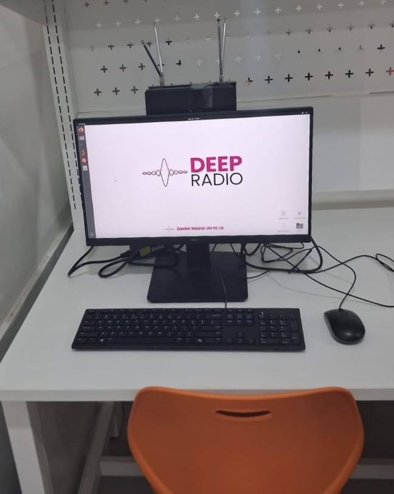
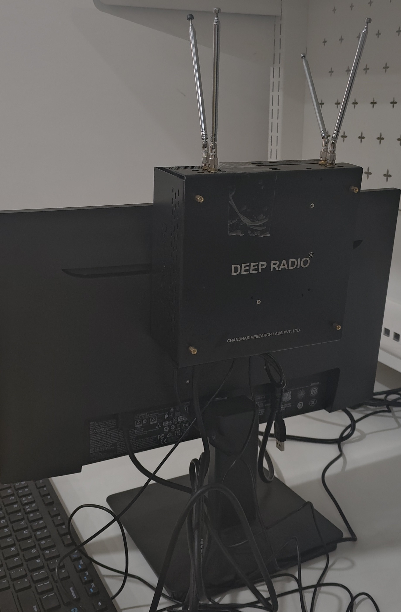

# Deep Radio

Deep Radio is an SDR based platform, designed:

- To teach and learn the fundamentals of signal processing and wireless communications
- To process real-time signals
- To develop applications of deep learning in wireless domain

---

<h2 class="features">Sample Experiments</h2>

- 2G, 3G, 4G Live Spectrum/Bands monitoring
- Live monitoring of GSM and 4G LTE stations
- Over-the-air transmission and reception using BPSK and QPSK Modems
- Verification of AWGN and small-scale fading channel distributions
- Verification of Autocorrelation Properties
- In spectrum to capture and visualize GSM and LTE signals
- OFDM Transmission and analysis
- Processing GSM and LTE signals
- Live AM and FM transmission and reception
- Jammer for Cellular and WiFi Channels
- Energy detection-based spectrum sensing
- Spectrum analysis from 100MHz to 6GHz
- ML based Spectrum activity Prediction
- ML-DL based Modulation Classification(BPSK,QPSK,GMSK,16QAM,64QAM,etc.)
- 5G Signal Generation and Transmission

---

## Product
Click on images to view larger.

{data-caption="Deep Radio Testbed at KL University, Hyderabad Campus"}

---
## Videos

  

    <iframe src="https://www.youtube.com/embed/9CAHiYudRog" allowfullscreen></iframe>
  

  

    <iframe src="https://www.youtube.com/embed/J-8PKwwRaDI" allowfullscreen></iframe>
  

<!-- ---

## Deep Radio – Gallery

{.gallery}
{.gallery}
{.gallery}

---
!!! info "To buy"
    For purchase, pricing, and demos, contact:
    Email: **info@chandhar-labs.com**  
    Kindly mention the **product name** in your message.
-->

---
!!! info "To buy"
    For purchase, pricing, and demos, contact:

    Email: **info@chandhar-labs.com**  

    Kindly mention the **product name** in your message.

