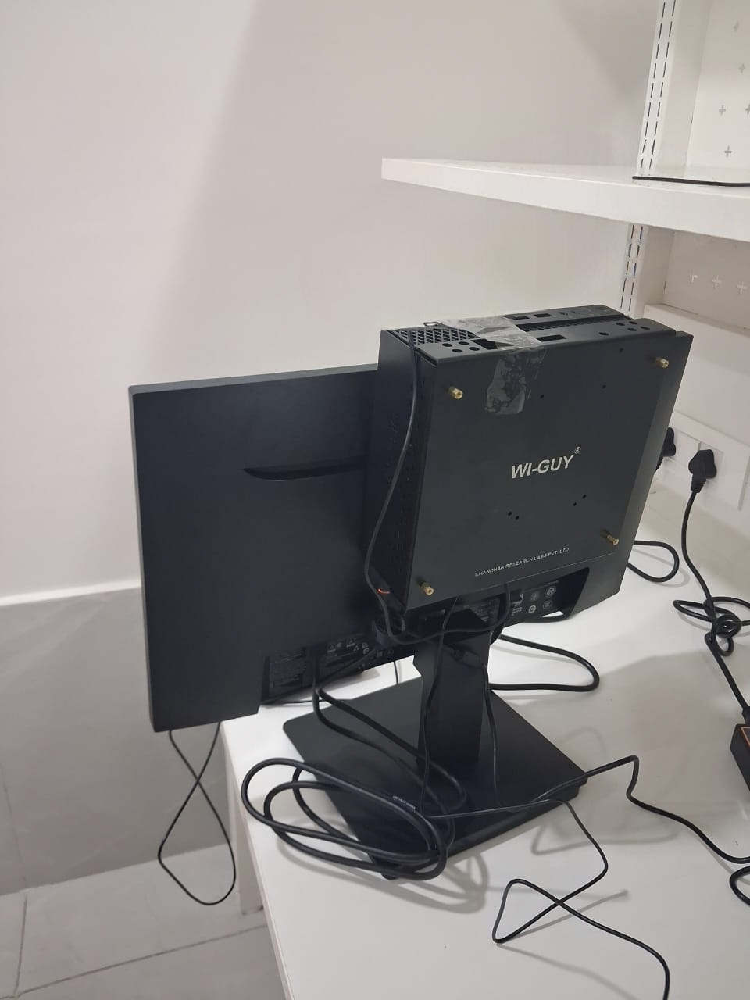

# Wi‑Guy – Wireless Learning Platform

**Wi‑Guy** is an SDR‑based educational platform for learning
wireless communication fundamentals.

## Focus Areas
- PHY concepts (modulation, coding)
- MAC layer behavior
- Hands‑on SDR experiments
- Academic and training usage

---

## Product

---

## Videos

  

    <iframe src="https://www.youtube.com/embed/9CAHiYudRog" allowfullscreen></iframe>
  

---

!!! info "To buy"
    For purchase, pricing, and demos, contact:

    Email: **info@chandhar-labs.com**  

    Kindly mention the **product name** in your message.

